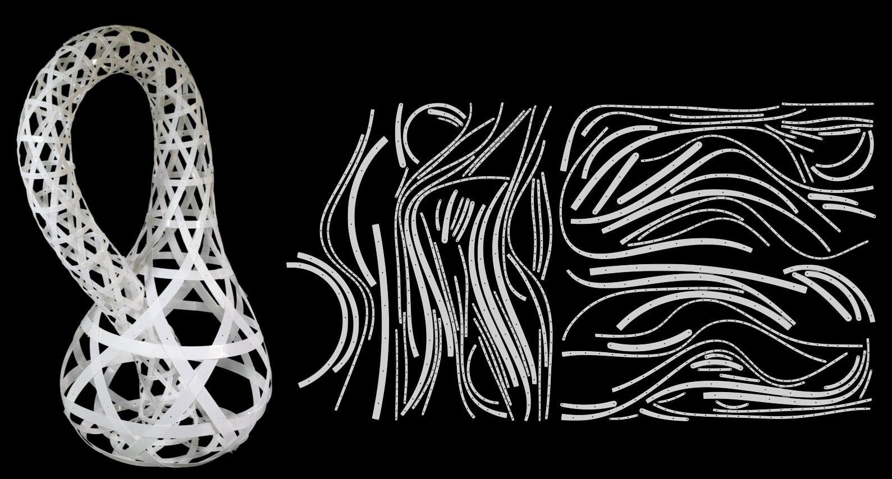

<!-- PROJECT LOGO -->
<p align="center">

  <h1 align="center"><a href="https://www.epfl.ch/labs/gcm/research-projects/smart-materials/curved-weaving/">3D Weaving with Curved Ribbons</a></h1>



  <p align="center">
    ACM Transactions on Graphics (Proceedings of SIGGRAPH), July 2021.
    <br />
    <a href="http://samararen.github.io//"><strong>Yingying Ren</strong></a>
    ·
    <a href="http://julianpanetta.com/"><strong>Julian Panetta</strong></a> 
    ·
    <a href="https://www.me.uh.edu/faculty/chen-tian-tim"><strong>Tian Chen</strong></a>
    ·
    <a href="https://people.epfl.ch/florin.isvoranu"><strong>Florin Isvoranu</strong></a> 
    ·
    <a href="https://samuel-poincloux.jimdofree.com"><strong>Samuel Poincloux</strong></a> 
    ·
    <a href="https://de.linkedin.com/in/christopher-brandt-301475158"><strong>Christopher Brandt</strong></a> 
    ·
    <a href="https://www.instagram.com/alisonmartin57/?hl=en"><strong>Alison Martin</strong></a> 
    ·
    <a href="https://people.epfl.ch/mark.pauly"><strong>Mark Pauly</strong></a>
    <br />
  </p>

  <p align="center">
    <a href='https://infoscience.epfl.ch/record/288072'>
      
    </a>
    <a href='https://www.epfl.ch/labs/gcm/research-projects/smart-materials/curved-weaving/' style='padding-left: 0.5rem;'>
      
    </a>
  </p>
</p>

# About 
This repository contains the source code and data for the paper 3D Weaving with Curved Ribbons, published at SIGGRAPH 2021.

# Getting Started

## C++ Code Dependencies

The C++ code relies on `boost` and `cholmod/umfpack`. The design optimization part of the code also depend on the commercial
optimization package [`knitro`](https://www.artelys.com/solvers/knitro/); these
will be omitted from the build if `knitro` is not found.

### macOS
You can install all the necessary dependencies except `knitro` on macOS with [MacPorts](https://www.macports.org):

```bash
# Build/version control tools, C++ code dependencies
sudo port install cmake boost suitesparse ninja glew libpng
# Dependencies for jupyterlab/notebooks
sudo port install npm6
```

## Python Environment
Create and activate the `conda` environment for this project with all the necessary python libraries by running
```bash
conda env create --file=environment.yml
conda activate weaving
```

The preferred way to interact with the code is in a Jupyter notebook,
using the Python bindings.
To use our customized viewer in Jupyter lab, install the adapted `pythreejs` library by running
```bash
git clone https://github.com/jpanetta/pythreejs
cd pythreejs
pip3 install -e .
cd js
jupyter labextension install .
```

To ensure that the `Python` library installed by `conda` is used during the compilation of the python bindings of the C++ code, run 
```bash
conda env config vars set PYTHON_EXECUTABLE=$(which python)                     
conda activate weaving
```

## Compilation
Compile the C++ code and Python bindings in the `elastic_rods` subdirectory:
```bash
cd elastic_rods
mkdir build
cd build
cmake .. -GNinja
ninja
```

## Quick Start 
To generate optimization results for all the models shown in [our paper](https://infoscience.epfl.ch/record/288072), change into the `weaving` subdirectory, then run ```python optimization_diagram.py```.
The results of the experiments will be collected in `weaving/optimization_diagram_results`. 
